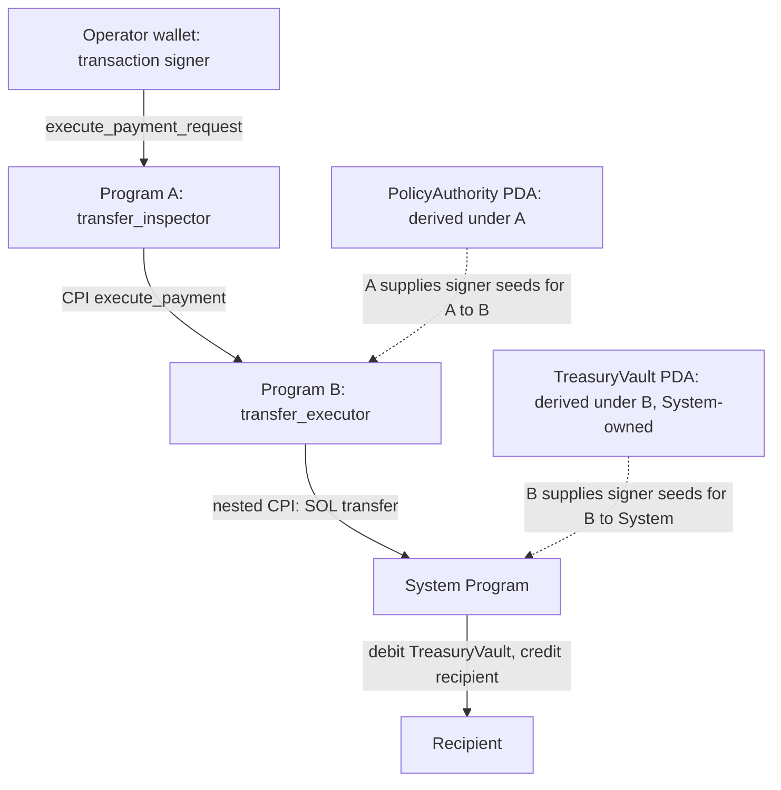

# Anchor / Solana CPI Lab

## Project Purpose

这是用于学习 CPI、PDA signer、account privilege、账户校验与失败回滚的实验项目，包含两个 Anchor Program：A = `transfer_inspector`，B = `transfer_executor`。它不是 production protocol，也不作 production-ready、已审计或生产部署的声明。

本文以 `programs/` 源码、`idls/` 接口和 `tests/` 实际断言为依据。逐用例证据见 [Security / Negative Test Matrix](docs/test-matrix.md)。

本次 Engineering Finish 的命令结果、运行环境与剩余告警见 [Validation Record](docs/validation.md)。

## Architecture



实线表示 instruction / transfer 流程，虚线表示某次 CPI 中获得的 PDA signer privilege。PolicyAuthority 和 TreasuryVault 都是账户地址，不是被调用的 Program。Operator 的签名用于 A 的授权检查；A→B 的 authority 是 PolicyAuthority；B→System 的转账 source signer 是 TreasuryVault。

程序 ID：

| Program | ID |
| --- | --- |
| A / `transfer_inspector` | `2CVzr8eS28y5daWUYJfsQdG8jucoEC2V4A6mLvBUD1Nr` |
| B / `transfer_executor` | `FQEPdYMcvsPeafF7kgDRedjYndwUEmp8J2sYYPiA8V64` |
| System Program | `11111111111111111111111111111111` |

## Program Responsibilities

| Program | 责任与状态 |
| --- | --- |
| `transfer_inspector` | 管理 PolicyConfig / PaymentRequest、operator authorization、request lifecycle、max payment / policy pause，决定是否允许 payment；成功后标记 Executed 并累计 `total_executed`。 |
| `transfer_executor` | 管理 TreasuryState / TreasuryVault、configured PolicyAuthority 授权、treasury pause、SOL payment execution、`total_paid` / `payment_count` accounting，并保留 Vault 的 rent reserve。 |

A 不理解 B 的 PDA seeds，只 forwarding B 所需的 treasury accounts；B 验证自己的 canonical TreasuryState 和 TreasuryVault。B 不理解 A 的 PolicyAuthority seeds，只检查 authority 已具有 signer privilege，并且 key 等于 TreasuryState 中存储的 `authorized_policy_authority`。初始化时由 admin 配置这个公钥，当前测试配置为 A 的 canonical PolicyAuthority PDA。

A 使用 `declare_program!(transfer_executor)` 从 `idls/transfer_executor.json` 生成类型和 CPI helper；它没有通过 Rust crate dependency 获取 B 的内部 seeds。`target/idl/` 和 `target/types/` 是构建产物，测试使用后者和 Anchor workspace client。

A 的 `build.rs` 显式跟踪 B source IDL 的变化，避免只修改该 JSON 后继续复用旧的 generated CPI module。Program ID 切换的诊断与一致性结果见 [Program ID diagnosis](docs/program-id-diagnosis.md)。

## Account Model

Owner 是链上账户 `owner` 字段，authority 是应用的授权身份，signer 是本次 instruction 执行上下文中的 privilege，PDA identity 是由 program ID 和 seeds 决定的地址。这四者不能互换。

下表的 writable / signer 以 payment execution 路径为准；初始化、request 创建、pause / resume 的 payer 和 admin 要求另见源码及 IDL。

| Account | Owner | Canonical identity / PDA | Authority | Writable | Signer requirement | Purpose |
| --- | --- | --- | --- | --- | --- | --- |
| PolicyConfig | A | A PDA `["policy_config"]` | `operator` 创建/执行；`admin` pause/resume | 是，A | 自身不签名 | policy limit、pause、next request ID、累计执行金额 |
| PaymentRequest | A | A PDA `["payment_request", policy_config, request_id LE u64]` | 当前 operator；必须匹配存储的 `requester` | 是，A | 自身不签名 | 固定 policy / requester / recipient / amount / request_id，保存 Pending / Executed |
| PolicyAuthority | 未由项目 `init`；无已分配状态账户，未分配地址在上下文中为 System-owned、零数据 | A PDA `["policy_authority"]` | A 可通过 signer seeds 授予 CPI signer privilege；B 信任配置的 key | 否，A→B | 顶层否；A→B 是 | B 的支付授权身份，不是存储 policy 的账户 |
| TreasuryState | B | B PDA `["treasury_state"]` | `admin` pause/resume；configured PolicyAuthority 执行 | 是，A→B | 自身不签名 | 授权 key、pause、累计金额与次数 |
| TreasuryVault | System Program | B PDA `["treasury_vault"]` | B 可为此 PDA 签名 | 是，A→B→System | 顶层及 A→B 否；B→System 是 | 零数据 SOL vault；保留 rent reserve |
| Recipient | 不限制 owner；测试 receiver 是 System-owned wallet | 等于 PaymentRequest 的 `recipient`，且不等于 Vault | 接收 SOL 无需 recipient 授权 | 是，A→B→System | 否 | 接收 payment |
| Program A | loader（部署决定；可升级部署时为 Upgradeable Loader） | 固定 A ID，顶层 instruction target | 部署升级权限不属于本业务授权模型 | 否 | 否 | policy instruction 执行程序 |
| Program B | loader（部署决定；可升级部署时为 Upgradeable Loader） | 固定 B ID；`Program<TransferExecutor>` | 同上；作为 A 的 trusted callee | 否 | 否 | payment instruction 执行程序 |
| System Program | Native Loader | 固定 System Program ID；`Program<System>` | runtime native program | 否 | 否 | 初始化账户与 SOL transfer |

Operator 本身是 A 的 transaction signer，源码把它声明为 writable，但没有把它转发给 B。PolicyConfig / PaymentRequest 也不进入 B 的 account list。Vault 虽由 B 派生，owner 仍是 System Program；PDA signer 能力与数据 owner 不相同。PolicyAuthority 的 seeds 约束不要求它由 A 拥有数据。

## PDA Model

以下是业务 seeds；每个 PDA 派生及 `invoke_signed` 还需要对应 bump。

| PDA | Deriving program | Seeds | Bump 使用 |
| --- | --- | --- | --- |
| PolicyConfig | A | `[b"policy_config"]` | 初始化保存 canonical bump；后续校验使用 `policy_config.bump` |
| PolicyAuthority | A | `[b"policy_authority"]` | A 执行时通过 `bump` 得到 canonical bump，并用于 A→B signer seeds |
| PaymentRequest | A | `[b"payment_request", policy_config.key().as_ref(), request_id.to_le_bytes()]` | 初始化保存 canonical bump；执行使用 `payment_request.bump` |
| TreasuryState | B | `[b"treasury_state"]` | 初始化保存 canonical bump；执行使用裸 `bump` 校验 canonical 地址，pause/resume 使用存储 bump |
| TreasuryVault | B | `[b"treasury_vault"]` | 初始化、fund、execute 使用裸 `bump`；执行所得 bump 用于 B→System signer seeds |

PaymentRequest 创建时，`policy_config.request_count` 的当前值被复制到新 request 的 `request_id`，然后 counter 加一。它是 **next-id counter**，不等于某个已创建 request 的永久 identity。执行旧 request 时使用它自己的 `request_id`，不能使用后来已递增的 `request_count`；u64 必须编码为 8 字节 little endian。测试 helper `tests/helpers/pdas.ts` 与源码一致。

## Signer Model

| 来源 | 本项目中的身份 | Privilege 来源与范围 |
| --- | --- | --- |
| Transaction wallet signer | operator；初始化/管理时为 admin，fund 时为 funder | wallet 的 transaction signature；本次调用及被允许的 CPI forwarding |
| PolicyAuthority PDA signer | B 的 `authority: Signer<'info>` | A 的 `new_with_signer` 提供 `[b"policy_authority", bump]`，runtime 按 caller A 的 ID 派生并授予此次 CPI signer privilege |
| TreasuryVault PDA signer | System transfer 的 `from` | B 的 `new_with_signer` 提供 `[b"treasury_vault", bump]`，runtime 按 caller B 的 ID 派生并授予此次 nested CPI signer privilege |

PDA 没有私钥。地址可公开计算，知道地址不会得到签名能力。`new_with_signer` 将 seeds 传给使用 `invoke_signed` 的 helper；runtime 校验 caller Program ID + seeds + bump，不能为另一个 Program 的任意 PDA 提升 signer privilege。Anchor `Signer<'info>` 只验证已有的 `is_signer`，不会制造 signer privilege。

PolicyAuthority 在顶层 instruction meta 中 readonly / non-signer，在 B instruction schema 中 readonly / signer；signer 的变化由 A 的 seeds 授权，writable 不需要提升。当前 privilege 测试仅检查这两层 client instruction metas，真实 PDA 签名则由 nested CPI happy path 验证。机制参考 [Solana CPI](https://solana.com/docs/core/cpi)。

## CPI Execution Model

```text
Client
  → A.execute_payment_request
      → B.execute_payment(amount)             [PolicyAuthority signer]
          → System Program.transfer(amount)  [TreasuryVault signer]
              TreasuryVault → Recipient
```

1. Client 提交 operator、PolicyConfig、PaymentRequest、PolicyAuthority、Recipient、TreasuryState、TreasuryVault、B Program account 和 System Program account。
2. A 校验 operator、canonical policy/request/PDA、已承诺 recipient、非 Vault recipient、policy pause、Pending、max payment。它向 B 转发 PolicyAuthority、TreasuryState、TreasuryVault、Recipient、System Program。
3. B 校验 authority signer、canonical TreasuryState 的 owner/type/seeds、canonical Vault seeds、configured authority key、treasury pause、正金额和扣除 rent reserve 后的余额。
4. B 为 Vault 签名并调用 System Program transfer。转账成功后 B 更新 accounting；B CPI 成功后 A 更新 request status 和 accounting。`?` 将错误沿调用链传播。

CPI 不能动态从链上读取一个未出现在当前执行上下文中的 account 并把它加入调用。本项目的 System Program 必须进入顶层 transaction，并通过 A 的 CPI account list forwarding 给 B；仅写下它的 ID 不能代替 account availability。

Anchor 1.1.2 的 `CpiContext.program_id` 是 `Pubkey`，决定 callee identity；`cpi::execute_payment` helper 按 B 的 instruction schema 编码 discriminator、amount 和 account metas。B 的 `system_program::transfer` helper 构造 System transfer instruction，其传给 syscall 的 account infos 是 from/to；System Program 本身作为执行目标必须可用，无需把它错误地当成 transfer 的数据账户。参考 [Anchor 1.1.2 CpiContext](https://docs.rs/anchor-lang/1.1.2/anchor_lang/context/struct.CpiContext.html)。

## Program ID Trust Boundary

`Program<'info, TransferExecutor>` 同时验证 executable 和固定 B ID，是 trusted callee identity 的边界。`declare_program!` / CPI helper 提供 schema，不替代这个信任检查。测试把 B meta 换成另一个真实 executable（System Program）来验证 `InvalidProgramId`。

若 caller 接受任意 executable Program，就可能形成 arbitrary CPI：caller 将原本愿意交给 trusted Program 的 accounts / privileges（包括本次授予的 PDA signer）交给恶意 Program。Callee 仍受 forwarded accounts 和 runtime writable / signer / owner 规则限制；风险不是拥有无限权限，而是滥用 caller 已交出的权限。固定 ID 也不证明部署代码永远不变：当前项目没有检查 B 的 upgrade authority。

## Security Invariants

| Invariant | 当前实现 / 证据边界 |
| --- | --- |
| Only configured operator may create/execute requests | A 的 requester address、policy operator 约束与 wallet signer；执行还匹配 request 的 requester |
| PaymentRequest belongs to canonical PolicyConfig | A 校验 policy seeds、request seeds / stored request_id / bump 和 `payment_request.policy` |
| Execution recipient matches the committed recipient | A 的 `address = payment_request.recipient` |
| Only Pending requests execute; each request executes at most once | A 检查 Pending，CPI 成功后写 Executed；replay 被拒绝 |
| Payment amount is positive and at most policy max | 创建时 A 检查正金额/max；执行时 A 重新检查 max；B 检查正金额 |
| Paused Policy cannot execute | A 在调用 B 前拒绝；暂停也阻止创建 request |
| Paused Treasury cannot execute | B 在调用 System Program 前拒绝 |
| A calls trusted TransferExecutor | typed `Program<TransferExecutor>` 验证固定 ID 与 executable |
| B only accepts configured PolicyAuthority signer | B 的 `Signer` + configured key equality；B 不重建 A seeds |
| Knowing PolicyAuthority address does not grant signer privilege | 直接调用 B 并移除 signer meta 会触发 `AccountNotSigner` |
| TreasuryState and TreasuryVault are canonical | B 验证 state 的 owner/discriminator/seeds 以及 Vault seeds；A 不复制这些校验 |
| Vault remains a System-owned, zero-data SOL vault | 初始化显式设定 owner/space，初始化测试检查；执行使用 `UncheckedAccount`，没有重复显式 owner/zero-data 约束，实际 debit 还受 System transfer/runtime 规则限制 |
| CPI failure cannot leave successful payment state/accounting | 错误传播使 transaction 失败；失败测试检查真实 payment snapshot 不变 |
| Recipient must not equal TreasuryVault | A 的 recipient raw constraint；B 没有独立的该检查，当前没有对应负面测试 |

上述约束不表示全部都有独立攻击测试。owner/type substitution 与合法类型但错误 seeds 的攻击也不同；详细范围见下面的矩阵。

## Security / Negative Test Matrix

[docs/test-matrix.md](docs/test-matrix.md) 逐项对应当前 **21 个 `it(...)` 用例**：初始化/注资 3、request 3、授权 2、账户替换 6、pause 生命周期 2、CPI target/meta 2、执行/replay 2、余额不足 1。表中记录 invalid input、预期拒绝层、保护的 invariant、失败后实际检查的状态。

它覆盖 unauthorized creation/execution、above max、直接 B 缺失 PDA signer、错误 policy/request/treasury/PolicyAuthority/vault/recipient、双方 pause、fake Treasury Program、replay、insufficient funds 和 nested CPI happy path。meta 用例只检查构造结果，不模拟 runtime privilege escalation；余额不足用例在 B 的余额预检处失败，不制造 B→System 转账失败。

## Atomic Rollback

如果 A 已修改 account，随后 B 或 B→System CPI 返回错误，只要错误传播使 transaction 失败，链上业务账户 modifications 不会提交。该保证来自 Solana transaction atomicity，覆盖 transaction 的多条 instructions 及 nested CPIs；已提交失败 transaction 的费用仍可能收取。参考 [Solana Transactions](https://solana.com/docs/core/transactions)。

这与普通 Rust 对内存对象 mutation 后返回 `Err` 不同：Rust 的 `Result` 本身不会撤销先前的 mutation。链上回滚由 runtime 的 transaction 执行/提交机制提供；若吞掉错误并最终成功返回，就不能假定整笔 transaction 会失败回滚。

本项目当前顺序是先 System transfer，后 B accounting，再 A status/accounting；A 没有在 CPI 前设置 Executed。若后续 checked-add 失败，`?` 仍使已发生的 transfer 一并回滚。现有余额不足测试证明拒绝后 Pending、双方累计金额、支付次数和 recipient/vault balance 均不变；它不证明“先写 A、再发生下游错误”的特定分支，也不触发 overflow。多数负面请求可能在 client preflight simulation 被拒绝，测试不强制提交失败 transaction。

## Known Limitations

- 全局 singleton Policy / Treasury / PolicyAuthority / Vault；没有 tenant/user 维度。共享 writable policy/treasury/vault 也会形成并行执行瓶颈。
- 仅 SOL，无 SPL Token / Token-2022、multisig、governance。没有 production monitoring 或应用自定义 events；Anchor instruction/error logs 不等于业务 event 系统。
- 两程序使用相同 hardcoded `INITIAL_ADMIN`：`mV8B9brE2rWGfbRWUKhqBws2PzdQLztfFWqLLZ8Rnn3`。无 admin/operator/authorized authority 轮换或 max limit 更新接口；初始化 B 时接收配置 key，不自行证明它是 A 的 PDA。
- Request 只有 Pending / Executed；没有取消、到期、关闭或 rent 回收。`created_at` 只记录创建时间，不实现 expiry；没有每个 request 的独立审批步骤。
- `fund_treasury` 是 Lab / test convenience，任何 signer 可转入正金额；直接向已知 Vault 地址转 SOL 仍可能发生。它不更新 deposit ledger，也不受 treasury pause 控制，不是完整 deposit accounting system。
- Recipient owner 未限制，测试只支付给 System-owned wallet。Vault 的 owner/zero-data 初始化条件没有在 execute/fund 入口重复显式验证；本次仅记录该边界，不修改业务规则。
- B 只理解配置的 signer 身份和支付金额，不理解 Policy / PaymentRequest / max limit / replay / committed recipient；这些保证来自 A。B 也没有独立 recipient≠Vault 校验。
- 固定 B ID 不检查部署 upgrade authority；没有可复现生产部署、审计、监控或生产安全声明。
- 现有 suite 共享 localnet 状态并依赖注册顺序；部分测试含后续场景恢复逻辑（fund fallback、pause resume），replay 在 happy path 未成功时会 skip。完整测试不等于完整安全 coverage，未测试项见矩阵。

## Running Tests

项目使用 Rust `1.89.0`（`rust-toolchain.toml`）与 Anchor `1.1.2`，`Anchor.toml` 的 cluster 是 `localnet`。`anchor build` 生成测试需要的 IDL / TS types；测试脚本是 `pnpm exec ts-mocha -p ./tsconfig.json -t 1000000 "tests/**/*.ts"`。

使用已有依赖和本地工具链，从仓库根目录运行：

```bash
cargo fmt --check
anchor build
cargo clippy --workspace --all-targets
anchor test
pnpm exec tsc --noEmit
pnpm lint
```

Anchor 1.1.2 的默认 local validator 是 Surfpool；需要现有 Surfpool 在 PATH。使用 Solana test validator 时可运行 `anchor test --validator legacy`，验证报告应区分它与默认命令。agent 执行 CLI 时使用 `NO_DNA=1`。

`Anchor.toml` 的 provider wallet 必须是上述 `INITIAL_ADMIN`，否则初始化会按设计拒绝。测试会创建测试参与者、在 localnet airdrop、部署程序并执行支付；无需把测试切换到 devnet/mainnet。重新跑完整 suite 需干净 localnet 状态，因为 singleton 使用 `init`。`pnpm lint` 仅对 JS/TS 做 Prettier check，不包含 Markdown；Rust 由 `cargo fmt --check` 检查。
